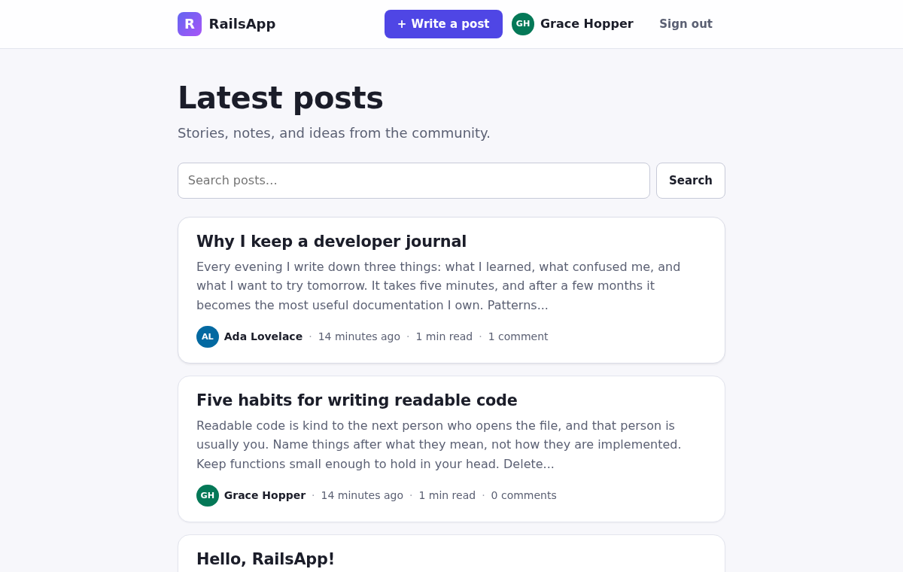
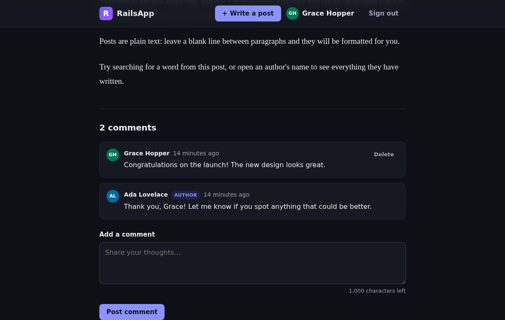

# RailsApp

A small, modern blogging app built with Ruby on Rails 8.1. Anyone can read posts; members can write
posts, edit and delete their own, and discuss them in the comments.

| Light | Dark |
| --- | --- |
|  |  |

## Features

- **Accounts**: sign up, sign in, sign out, and reset a forgotten password by email
  (built on the Rails 8 authentication generator). Sign-in, sign-up, password resets, and comments
  are rate limited.
- **Posts**: write, edit, and delete your own posts. Other people can read them but not change them.
- **Comments**: added and removed in place with Turbo Streams, no page reload. Commenters can delete
  their own comments, and post authors can moderate the discussion on their posts.
- **Search and pagination**: search post titles and bodies (every word must match), ten posts per page.
- **Author pages** listing everything a person has written.
- **Responsive design** with automatic dark mode, keyboard-friendly focus styles, and accessible
  form errors. Plain CSS, no build step.
- **Security**: a strict Content Security Policy, HTML-escaped user content, authorization checks on
  every change, and no email addresses exposed publicly (including in the JSON API).
- **JSON API** for reading posts: `GET /posts.json` (paginated with `?page=`) and `GET /posts/:id.json`.

## Requirements

- Ruby 3.2 or newer (the version used for development is in [`.ruby-version`](.ruby-version))
- SQLite 3 (bundled with the `sqlite3` gem, nothing to install)
- Google Chrome, only for running the browser-based system tests

On Windows, install Ruby with [RubyInstaller](https://rubyinstaller.org/) (choose a "Ruby+Devkit" build).

## Getting started

```sh
git clone https://github.com/suryanarayanrenjith/RailsApp.git
cd RailsApp
bin/setup
```

`bin/setup` installs gems, creates the database, loads demo content, and starts the server at
<http://localhost:3000>. Later, start the server with `bin/dev`.

On Windows, run the scripts through Ruby: `ruby bin/setup`, `ruby bin/dev`, and `ruby bin/rails …`.

The demo content includes two accounts you can sign in with:

| Email | Password |
| --- | --- |
| `ada@example.com` | `password123` |
| `grace@example.com` | `password123` |

Reload the demo content at any time with `bin/rails db:seed:replant`.

### Emails in development

Emails, like password reset links, are not sent in development. They are written to `tmp/mails/`
and printed in the server log. You can also preview every email template at
<http://localhost:3000/rails/mailers>.

## Tests and code quality

```sh
bin/rails test         # model, controller, mailer, and helper tests
bin/rails test:system  # browser tests in headless Chrome
bin/rubocop            # code style (rubocop-rails-omakase)
bin/brakeman           # static security analysis
bin/bundler-audit      # known vulnerabilities in gems
bin/importmap audit    # known vulnerabilities in JavaScript packages
bin/ci                 # all of the above, the same way CI runs them
```

GitHub Actions runs the same checks on every pull request and on pushes to `main`
(see [`.github/workflows/ci.yml`](.github/workflows/ci.yml)).

## Deployment

The included [`Dockerfile`](Dockerfile) builds a production image that serves the app with Puma
behind [Thruster](https://github.com/basecamp/thruster), and runs background jobs (such as sending
emails) inside the same container.

```sh
docker build -t rails_app .
docker run -d -p 80:80 \
  -e SECRET_KEY_BASE="$(bin/rails secret)" \
  -e APP_HOST=blog.example.com \
  -v rails_app_storage:/rails/storage \
  --name rails_app rails_app
```

All data lives in SQLite databases under `/rails/storage`, so keep that volume (or another persistent
disk) between deploys. The database is created and migrated automatically when the container starts.

The app expects to sit behind a proxy that terminates HTTPS. To try the image on your own machine over
plain HTTP, add `-e RAILS_FORCE_SSL=false` and open <http://localhost>.

### Environment variables

| Variable | Purpose |
| --- | --- |
| `SECRET_KEY_BASE` | **Required.** Signs and encrypts cookies. Generate one with `bin/rails secret`. Alternatively, create encrypted credentials with `bin/rails credentials:edit` and provide `RAILS_MASTER_KEY`. |
| `APP_HOST` | Public host name used in links inside emails, e.g. `blog.example.com`. |
| `MAILER_FROM` | Sender of outgoing emails. Defaults to `RailsApp <no-reply@example.com>`. |
| `SMTP_ADDRESS`, `SMTP_PORT`, `SMTP_USERNAME`, `SMTP_PASSWORD` | Outgoing mail server. Without them, password reset emails cannot be delivered. |
| `RAILS_FORCE_SSL` | HTTPS is assumed and enforced by default, since production apps normally sit behind a TLS-terminating proxy. Set to `false` to serve plain HTTP, for example to try the image on `http://localhost`. |
| `RAILS_LOG_LEVEL` | Log verbosity. Defaults to `info`. |

## Project layout

| Path | What lives there |
| --- | --- |
| `app/models` | `User`, `Session`, `Post`, `Comment`, plus `Pagination` (a small page-splitting helper) |
| `app/controllers` | Posts, comments, author pages, and the sign-up, sign-in, and password reset flows |
| `app/controllers/concerns/authentication.rb` | Session handling shared by every controller |
| `app/form_builders` | Form builder that links invalid fields to their error messages for screen readers |
| `app/views` | ERB templates; `comments/*.turbo_stream.erb` update comments in place |
| `app/javascript/controllers` | Stimulus controllers for dismissible messages and character counters |
| `app/assets/stylesheets/application.css` | All styles, built on CSS custom properties |
| `test/` | Model, controller, mailer, helper, and system tests |

## Upgrading from the original version

This project started as a Rails 7.0 scaffold that only ran on the machine it was created on. It was
rebuilt on Rails 8.1 because Rails 7.0 and Ruby 3.1 no longer receive security fixes.
